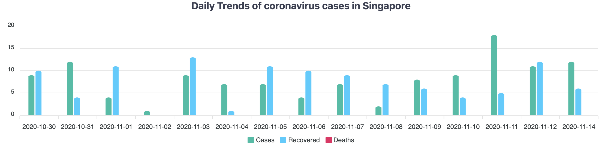

[Back to the main page](/README.md)

# Step 1: Original Data Visualization:

@ Source: [Corona World](https://coronaworld.info/country/Singapore)

This chart is from a website named Corona Wrold. And the data here is the Daily Trends of coronavirus cases in Singapore in the past two weeks, it includes the confirmed cases, recovered, and death data. The reason I choose this data is because I used to study in Singapore, and Singapore is one of the countries that controls the Covid-19 very well. Therefore, by analyzing the data in Singapore we can see how the trend is in Asia, also, it could provide some useful information for the West Countries in controlling the Covid-19 situation.

# Step 2: Critique the data visualization

### 1. Describe your overall observations about the data visualization here. What stood out to you? What did you find worked really well? What didn't? What, if anything, would you do differently?
Overall, this chart allows the audience to visually and clearly see the Covid-19 situation of Singapore in the last two weeks. 

The advantage for this chart is that, first of all, the different colors distinguish the confirmed cases and the recovered cases. Secondly, the title clearly expresses the theme, that is, the trend of the coronavirus epidemic in Singapore. In addition, by clicking each box, the chart can show audiences the exact number of cases every day, which is convenient for users to view. 

Regarding the disadvantages, first of all, the red mark of "Death" appeared in the bottom of the chart, but it took me some time to find the data about "Death" in the chart. It turns out that there has been no death in Singapore for a long time. So I will delete the "Death" in the bottom, and use one short sentence at the bottom of the chart to tell the audiences that there has been no recent death data. In addition, because this chart uses the form of a bar chart, the audience needs to struggle to find the trend in the chart. So I will change the bar chart to a line chart to better show the trend. In addition, the confirmed case and recovered cases are put together in the chart, so that readers cannot clearly distinguish them. Therefore, I will separate these two kind of data to make each chart more clear.

### 2. Who is the primary audience for this tool? Do you think this visualization is effective for reaching that audience? Why or why not? 
The audience for this chart is mainly the people live in Singapore, as well as those who need to travel or work in Singapore. In addition, some government or private institutions that analyze data also need data on Singapore’s Covid-19 data. In this chart, by placing the mouse on each chart, users can see each day's confirmed data and recovered data, but it is not intuitive to see the trend and also hard to predict the future trend of the Covid-19 in Singapore.

### 3. How successful what this method at evaluating the data visualization you selected? Are there measures you feel are missing or not being captured here? What would you change?
In this part, I use Stephen Few’s Data Visualization Effectiveness Profile from Usefulness, Completeness, Perceptibility, Truthfulness, Intuitiveness, Aesthetics, and Engagement. This method makes me think about the objective and subjective part of a chart. Through the evaluation of these seven dimensions, we can know which part should be improved. For Good Chart, it focuses more on the subjective experience of the analyst, such as 'what do I like', 'dislike', and 'what to change'. Therefore, Stephen's method will be more detailed for us to judge from every aspect of data visualization. But I think both methods are good and effective means for evaluating and improving data visualization. For the missing part, I think it would be better if we can add a dimension about whether the data visualization fits with the topic of the context or not. Because at present, for the 'Engagement' part, it more emphasis on 'Does it lead the audience to learn more about the topic?'. So it would be better if this part could be added.
