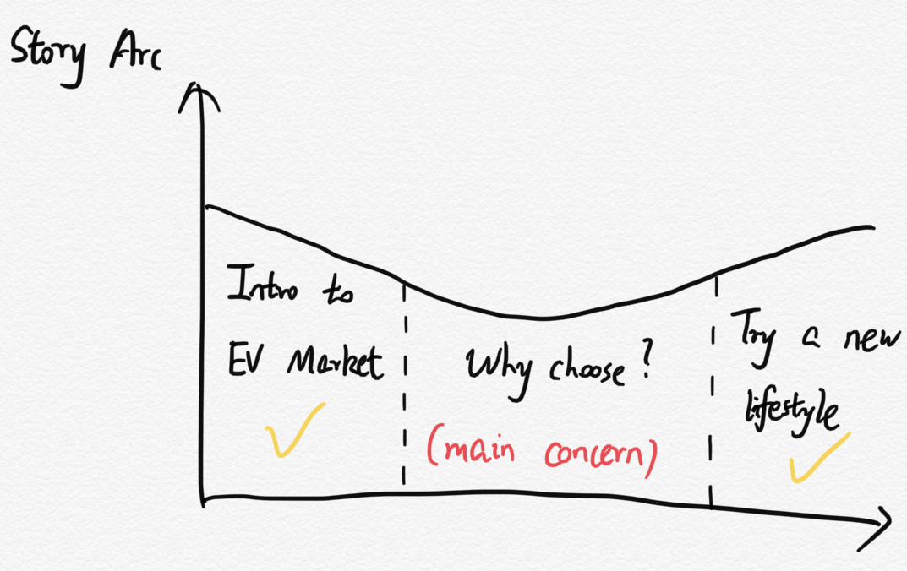

### For Part II, please click [here](https://yilunhuo.github.io/yilunhuo_portfolio/dataviz5.html) to check.
1. Sketches and storyboards
2. User research protocol and findings
3. Wireframes

### For Part III, please click [here](https://yilunhuo.github.io/yilunhuo_portfolio/dataviz6.html) to check.
1. Intended audience
2. Changes have made
3. Final project

# 1. An outline
### Project summary: 
Electric Vehicle Market is growing fast. Try a new way to a more clean energy life.

### Project structure:
1. Introduction to the market of EV in recent years(Different states in United States, EV market in China vs United States).
2. Why people choose EV, what are their main concern. What can EV bring to life and the environment.
3. Conclusion(take action): try a new lifestyle!

### Project arc:

# 2. Initial sketches

<a href="https://infogram.com/3db982b1-e4b1-4a16-8a0e-a0ec7942a942" style="color:#989898!important;text-decoration:none!important;" target="_blank">Infographic Modern</a> <a href="https://infogram.com" style="color:#989898!important;text-decoration:none!important;" target="_blank" rel="nofollow">Infogram</a>

# 3. The data
In this part, I will show how to obtain the required data.The data for this project are mainly divided into two aspects. The first aspect is the development of the electric vehicle market and the development of electric vehicles market between different countries. The second part is people's attitude towards choosing electric vehicles and the impact of electric vehicles on the environment.

For the first part, I will mainly get the required data from the [EV Data Center](https://www.ev-volumes.com/datacenter/) and [Global EV Outlook](https://www.iea.org/reports/global-ev-outlook-2020).

The data center gives users unlimited access to all of the xEV global market intelligence. This includes monthly registrations, vehicle information and specifications, charging infrastructure, incentive plans and battery delivery (in MWh), supplier and OEM models. It also have other databases, forecasts and reports. 

Global electric vehicle outlook is an annual publication designed to identify and discuss the latest developments in electric vehicles worldwide. It was developed with the support of members of the electric vehicle initiative (EVI). Combining historical analysis with projections for 2030, the report analyzes key areas of concern, such as EV and charging infrastructure deployment, cost of ownership, energy use, carbon dioxide emissions and battery material requirements.

For the second part, in order to get the attitude of peoples's willingness to buy the EV, I choose to use [D1EV](
https://www.d1ev.com/kol/108057#:~:text=%E5%9C%A8%E7%94%A8%E6%88%B7%E5%80%BE%E5%90%91%E4%BA%8E%E9%80%89,%E7%94%A8%E6%88%B7%E5%8D%A0%E6%AF%94%E9%AB%98%E8%BE%BE55.0%25%E3%80%82&text=%E5%8F%A6%E5%A4%96%EF%BC%8C%E8%B6%85%E8%BF%875%E6%88%90%E7%94%A8%E6%88%B7,%E5%8D%A0%E6%AF%94%E8%BF%914%E6%88%90%E3%80%82). This is a website about the electric car market survey. On this website, we can clearly see people’s willingness to buy electric cars, the reasons why people are willing to buy electric cars, the reasons why people are unwilling to buy electric cars, and users expectations for electric vehicles. In addition, I used [EnergyWise](https://www.edfenergy.com/for-home/energywise/electric-cars-and-environment), where it shows the benefits of electric cars on the environment. I will use these to better illustrate the environmental changes brought by the use of electric cars.

# 4. Method and medium
For my final project, I will use Shorthand as my main tool, and at the same time, I will use Tableau to process some of the charts. My project will be completed in 2 weeks. In the first week, first of all, I will focus on learning how to use shorthand and roughly build the framework of my project. In addition, I will process the main charts. I will use the data I found to construct all the charts using the data visualization method I learned in class. In the second week, I will add relevant text information to make the context of the project more coherent. In addition, I will show my project to some of my friends and get their feedback. Then I will modify my work to make it more clear and beautiful. Finally, I will use two days to prepare my presentation and display it in class.

[Back to the main page](/README.md)
